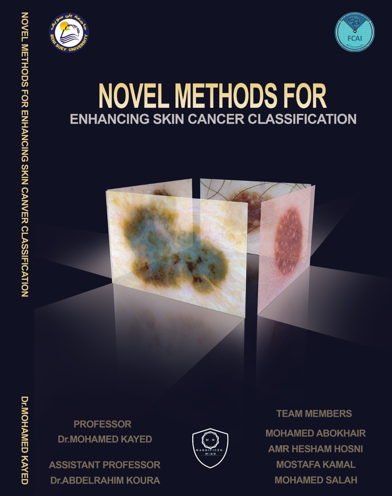

# Novel methods for enhancing skin cancer classification

Graduation project(research about skin cancer)

This study aims to create new methods from problems that we will meet or face in skin cancer ICIS 2018 Challgne that commen method was not the best option for these problems

Results are 2 methods one in segmentation of skin cancer called limited crop certain(LCC) its pseudocode (to fully understand it or to know how to use it read document pdf by recommendation)

 

and one in ensemble give each skin cancer class weight called class weight transformation(CWT) its psudocode (to fully understand it or to know how to use it read document pdf by recommendation) 

   

we did not aim to get high results we just want to prove that our methods worth to try as replacement for common methods in this field

Heightest results: we could achive was by novel ensemble (CWT) (best 10 simple models no 5-fold) 83,4% balanced accurcy on live leader board without extra data within our experiments

Best first teams of skin cancer challenge isic 2018 

(LCC) was compared with crop certain(crop based on prediction of mask) by simple analysis and with bitwise(AND mask with image) by models created to compare limited crop with bitwise.

(CWT) was compared with stacking ensemble (average and voting).

About Data: data are uploaded into Google drive to reach it with colab , all data needed would be found in single CNN model code as comment links are shared and you can just click add to my_drive and use it normally in colab after connected to same driver , data( data of challenge with test ,our edited copy after apply limited crop on training and test , and another copy by bitwise) 

Method: LCC have example in code not optimized as the same in psudocode but do the same target , CWT have no example in code but feel free to ask if you apply it as code and want to make sure, in future we plan to put clear easy to understand code as example for both methods you can wait or shot your question right away and someone will answer for sure.   

Important note : all notebooks were created on Google colab due our limited resources so path system would be different if you used it on your laptop and you will be forced to download all data from drivers instead of just including it as add to my drive from links that we provide in some of the notebooks.

Recommendation : if you want to understand just the 2 novel method and not interested in anything else foucs reading only on start of explaination of each method in both chapters( 'page: 39 ' pre-processing chapter for (LCC) , 'page: 92 ' training and test results chapter for (CWT)) but you will find compare results upside pages in case of CWT.

Team would like to Thank you for being patient reader ,we hope you enjoy reading the 2 novel methods feel free to leave comments.

MM team

