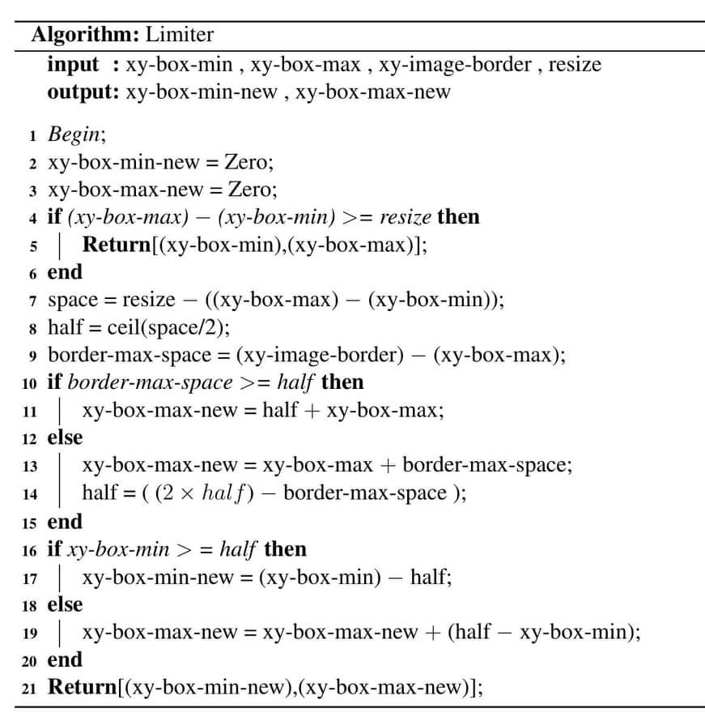
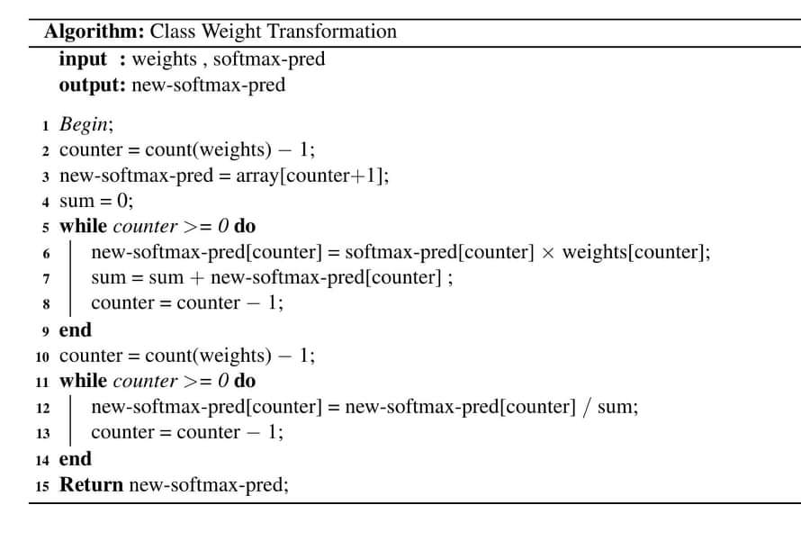
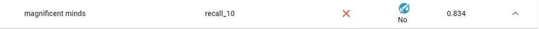

# Novel methods for enchancing skin cancer classication

This study aims to create new methods from problems that we will meet or face in ICIS 2018 Challgne that commen method was not the best option for these problems

Results are 2 methods one in segmentation called limited crop certain(LCC) its pseudocode (to fully understand read document by recommendation)

 

and one in enseble call class weight transformation(CWT) its psudocode  (to fully understand read document by recommendation) 

   

we did not aim to get high results we just want to prove that our methods worth to try as replacement for common methods 

heightest results we could achive was by novel enseble (CWT) (best 10 simple models no 5-fold) 83,4% balanced accurcy on live leader board without extra data within our experiments

Best first teams of this challenge

(LCC) was compared with crop certain by simple analysis and with bitwise(AND mask with image) by models

Important note : all notebooks were created on Google colab so path system would be so different if you used it on your laptop and you will be forced to download all data from drivers instead of just including it.

recommendation : if you want to understand just the 2 method and not interested in anything else foucs reading only on start of explaination of each method in both chapters('page:' pre-processing chapter for (LCC) ,'page:' training and test results chapter for (CWT)) 
